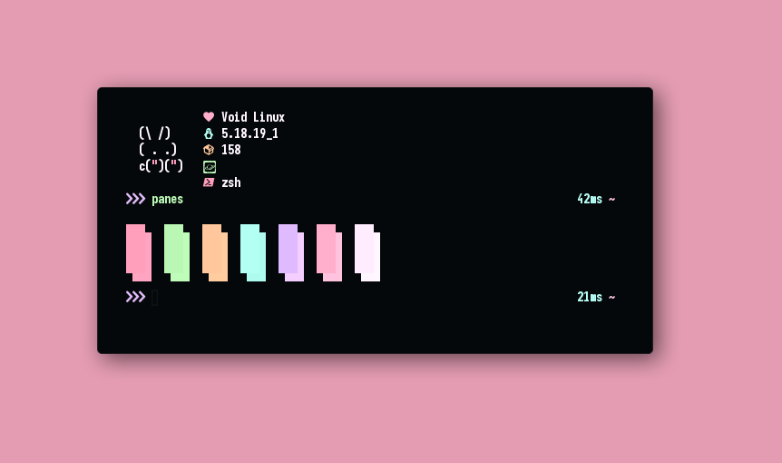

# SAGA for GTK
A Dark theme for [Wezterm](https://github.com/wez/wezterm)



## Installation
```
git clone https://github.com/SAGAtheme/wezterm $XDG_CONFIG_HOME/wezterm
```

## Optional
1. Install the [Starship](https://starship.rs/) prompt.
2. Set it as your prompt in your shell config.
3. Install the [SAGA config](https://github.com/SAGAtheme/Starship) for Starship.
## License

[MIT License](./LICENSE)

## Credit
Template config file from [Rxyhn](https://github.com/rxyhn/).
